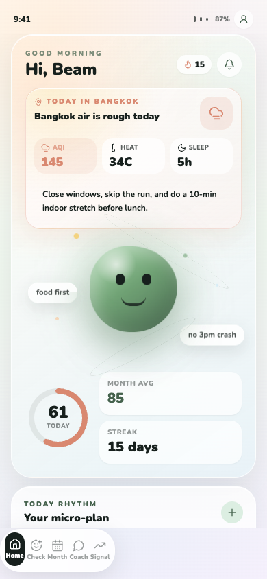
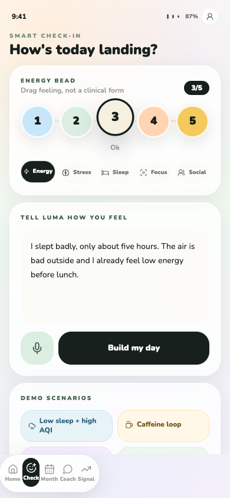
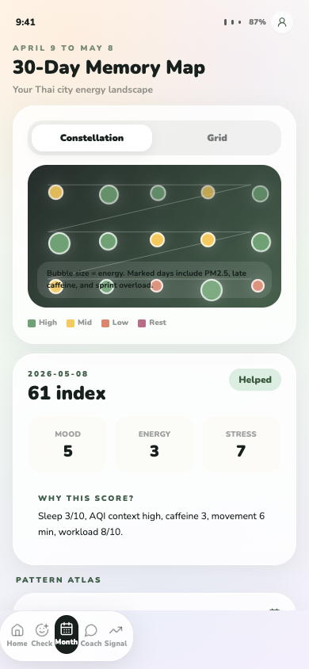
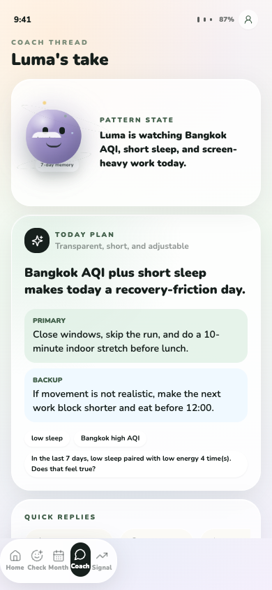
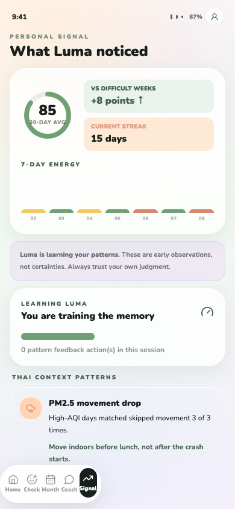
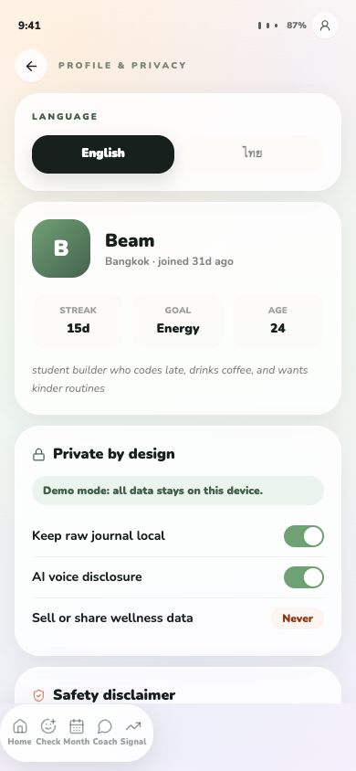

# RoutineSense AI Review Pack

Date: 2026-05-08

Purpose: handoff package for another LLM, designer, engineer, or judge-mode reviewer to critique the current RoutineSense AI mobile UX after the Kimi design review was implemented.

## Product Direction

RoutineSense AI is a Thai-first daily wellness and energy copilot for the OpenAI Codex x AIAT Hackathon Thailand.

Core sentence:

> RoutineSense learns what silently breaks your energy, then helps you act before the day goes off track.

Positioning shift after review:

> From "wellness tracker with a mascot" to "Thai-context intelligence layer that happens to be warm."

Important framing:
- Wellness support, not diagnosis, therapy, or treatment.
- Mobile app experience, not landing page.
- Cute and warm, but premium enough for an OpenAI x AIAT demo.
- Thai urban context should be obvious within 3 seconds.
- The mascot, Luma, should interpret Bangkok life instead of decorating generic wellness data.

## Current Screenshots

Captured at mobile viewport, 390 x 844.

### Home

### Check-in

### 30-Day Memory Map

### Coach

### Signal / Insights

### Profile / Privacy

## Implementation Summary After Kimi Review

P0 completed:
- Bottom nav overlap reduced with stronger scroll padding.
- Home now leads with an "Energy Weather" card: Bangkok AQI 145, heat index 34C, 5h sleep, one direct recommendation.
- Home signal tiles were removed from the first viewport to make the screen more narrative.
- Memory map now uses "30-Day Memory Map" and explains the April 9 to May 8 range.
- Constellation is now the default memory view, with Grid as the alternate view.
- "Send anonymous usage stats" was removed from Profile.
- Profile now uses a static trust badge: "Demo mode: all data stays on this device."

P1 completed:
- Thai/English language toggle added in Profile.
- Thai-specific pattern cards added in Signal: PM2.5 movement drop, Bangkok sprint fatigue, hot night recovery friction.
- Luma is reframed as stateful companion reacting to AQI, short sleep, and screen-heavy work.
- Pattern cards now include a "Based on these days" trail and user feedback actions.

P2 completed:
- Numeric mood scale replaced by tactile "Energy bead" selector.
- Check-in mode selector added: Energy, Stress, Sleep, Focus, Social.
- CTA changed from generic planning language to "Build my day."
- Diary placeholder rotates through Thai and English prompts.
- Data export affordance added in Profile.
- Functional emoji removed from source UI; open-source Lucide icons are used for functional symbols.

## Comparative Change Log

### Home

Before:
- Mascot, ring, four signal tiles, nudge, and rhythm competed for attention.
- Thai context was present but not dominant.
- The judge could read it as a generic wellness dashboard.

Now:
- The first content card is "Today in Bangkok."
- AQI 145 is treated as the primary signal, with heat and sleep as supporting context.
- Luma sits below the data as an interpreter, not the only brand signal.
- The recommendation is concrete: close windows, skip the run, stretch indoors before lunch.

Review questions:
- Should AQI pulse more visibly, or would that feel too alarmist?
- Should the Home first viewport expose commute load too, or keep the story tight?
- Should "Today in Bangkok" become "Energy Weather" as the visible title?

### Check-in

Before:
- Numeric 1-5 mood controls felt clean but clinical.
- The screen was the weakest and most form-like.
- CTA was generic.

Now:
- Energy bead selector gives a tactile mobile interaction.
- Mode pills make the check-in multidimensional without adding a full form.
- Thai prompt "วันนี้เจออะไรที่กินพลังที่สุด?" appears in the diary placeholder rotation.
- Demo scenarios are more Thai/contextual, including Sprint mode and Hot season fatigue.

Review questions:
- Should the energy bead be draggable instead of tap-only?
- Should each mode subtly change the diary prompt and recommendation style?
- Is the Thai prompt enough, or should bilingual mode change all visible copy?

### 30-Day Memory Map

Before:
- Looked like a calendar with an interesting constellation extra.
- Mixed April-May range needed explanation.
- The distinctive constellation view was not the hero.

Now:
- Title is locked to "30-Day Memory Map."
- Subtitle frames it as a Thai city energy landscape.
- Constellation is default, with Grid as a toggle.
- Grid days include context markers for AQI spike, late caffeine, sprint overload, Songkran/social load, and hot night.
- Selected day has a "Why this score?" explanation.
- Pattern Atlas cards sit below the map.

Review questions:
- Should Memory Map become the default landing screen after day 3?
- Should tapping a constellation node open the day detail immediately?
- Should we reduce calendar grid importance further and make constellation the signature?

### Coach

Before:
- Chat transcript format felt like support chat.
- Recommendation card could be clipped.
- Luma was present but not stateful enough.

Now:
- Screen opens with "Luma's take" and current pattern state.
- Today Plan is the hero card, above quick replies.
- Coach voice references Bangkok AQI, short sleep, and screen-heavy work.
- Quick replies are concrete: Make it easier, Why this?, I cannot do that, Plan around Bangkok AQI.
- Safety mode references Thailand crisis resources without implying diagnosis.

Review questions:
- Should chat history be hidden behind a small "history" affordance?
- Should "Why this?" open the same evidence trail used by pattern cards?
- Is the coach voice warm enough without becoming too cute?

### Signal / Insights

Before:
- Strongest analytical screen, but pattern cards felt static.
- Starter memory card felt apologetic.

Now:
- "Luma is learning your patterns" reframes uncertainty as trust, not weakness.
- "Learning Luma" progress indicator updates when the user gives feedback.
- Pattern cards include evidence trails and feedback buttons.
- Thai context patterns are specific to PM2.5, Bangkok sprint fatigue, and hot weather recovery.

Review questions:
- Should confidence visually change after each feedback action?
- Should "Not true" ask why, or is that too heavy for a hackathon demo?
- Which Thai context pattern should be first for strongest judge impact?

### Profile / Privacy

Before:
- Privacy stance was clear, but "anonymous usage stats" weakened the trust narrative.
- No language toggle.
- Crisis copy needed stronger Thai framing.

Now:
- Language toggle added.
- Demo local-data badge replaces anonymous stats.
- Export wellness memory button added.
- Safety copy references Thailand Department of Mental Health 1323 and Samaritans of Thailand 02-713-6793 with availability caution.

Review questions:
- Should export be visible in Profile or hidden under "Data controls"?
- Should Thai safety copy be shown when Thai language is selected?
- Should demo mode include a "Delete raw diary" button as a stronger privacy signal?

## Thai-First Product Strategy

The strongest hackathon angle is to make RoutineSense feel like it could only have been built in Thailand first.

Signals already represented in mock data:
- Bangkok AQI / PM2.5.
- Heat index and hot season fatigue.
- Late caffeine after coding.
- Hackathon/work sprint recovery.
- Songkran/social load context.
- Thai/English wellness microcopy.
- Local safety resources.

Next feasible Thai data sources for a demo:
- OpenAQ or equivalent air-quality API for Bangkok PM2.5.
- OpenWeatherMap or equivalent heat index.
- Hardcoded Thai holidays and Songkran recovery.
- Hardcoded commute load/BTS/MRT status for demo realism.
- User-reported meal timing and caffeine timing.

Narrative to preserve:

> Bangkok AQI is 145 and Beam slept 5 hours. RoutineSense predicts an energy crash around 15:00, recommends a smaller indoor recovery plan, then lets Beam confirm whether the pattern was true so Luma learns.

## Open Questions For Another LLM / Reviewer

Use these as critique prompts:

1. What should be removed now that Kimi's P0/P1 changes are implemented?
2. Which screen still feels weakest for a hackathon judge and why?
3. Should Home lead with "Today in Bangkok" or the term "Energy Weather"?
4. Is Luma cute-premium, or still too generic?
5. Should the Memory Map replace Home as the main returning-user screen?
6. Does the constellation communicate "post-AGI wellness memory" clearly enough?
7. Which single interaction best shows collaborative AI learning: bead slider, evidence trail, or pattern feedback?
8. Where should Thai copy become full bilingual UI instead of microcopy?
9. Which Thai signal has the highest credibility-to-effort ratio for the demo?
10. How can we make personalization feel intelligent without implying medical diagnosis?
11. Is the privacy story strong enough for wellness data?
12. Are animations supporting state and hierarchy, or are any still decorative?
13. Does the bottom nav now feel native-mobile enough?
14. What would make a 90-second judge demo unmistakably OpenAI-quality?

## Suggested Next Design Moves

Highest leverage:
1. Add a hidden Judge Mode that walks through a 90-second demo path.
2. Make "Why this?" open a transparent evidence trail in Coach.
3. Add a more explicit AQI/heat visual state to Luma on Home.
4. Make constellation nodes tappable and connect them to day-level causes.
5. Add Thai language rendering for the safety block and top-level labels.
6. Add a lightweight export mock action that previews JSON/CSV ownership.

Potential tagline:

> Built for the hidden energy cost of Thai city life.

## QA Status

Commands run:
- `npm test` passed.
- `npm run build` passed.

Browser checks:
- App loads at `http://localhost:3000/`.
- Page title: `RoutineSense AI — Your Daily Wellness Copilot`.
- No framework error overlay detected in DOM snapshot.
- No relevant console warnings/errors from Browser dev logs.
- Bottom nav routes render expected content: Home, Check, Month, Coach, Signal.
- Check-in interaction tested: Energy bead changed from 3/5 to 4/5 and Focus mode selected.
- Profile trust controls visible: local data badge, export button, 1323 safety reference.
- Signal interaction tested: "Feels true" feedback increments Learning Luma session count.

Visual evidence:
- Browser screenshot capture timed out via the in-app browser screenshot API, so current visual QA evidence is the regenerated local screenshot set under `review-screenshots/`.

## Current File Areas To Review

- `src/app/page.tsx`
- `src/app/globals.css`
- `src/components/MascotLuma.tsx`
- `src/components/PatternCard.tsx`
- `src/components/screens/HomeScreen.tsx`
- `src/components/screens/CheckinScreen.tsx`
- `src/components/screens/CalendarScreen.tsx`
- `src/components/screens/CoachScreen.tsx`
- `src/components/screens/InsightsScreen.tsx`
- `src/components/screens/ProfileScreen.tsx`
- `src/data/seed.ts`
- `src/lib/wellness.ts`

## Reference Links

- Apple Human Interface Guidelines, Motion: https://developer.apple.com/design/human-interface-guidelines/motion
- Material Design motion: https://m1.material.io/motion/material-motion.html
- Thailand Department of Mental Health: https://dmh.go.th/main.asp
- Thailand.go.th 1323 consultation detail: https://www.thailand.go.th/public/index.php/issue-focus-detail/001_07_045
- PM2.5 risk perception and anxiety research including Bangkok and Chiang Mai: https://www.mdpi.com/2413-8851/9/7/256
